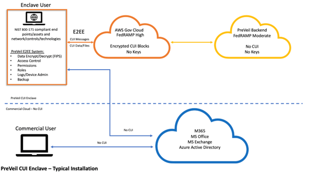

# Deepwave Digital System Security Plan (SSP)

## 1. About this Document

The System Security Plan (SSP) is designed to provide an overview of the security requirements of the system and describe the controls in place or planned for meeting those requirements. The SSP also defines responsibilities and expected behavior of all individuals who access the system.

This document and its accuracy are critical for system certification activity. For this reason, this SSP will be reviewed and updated, as necessary, at least annually. Documentation of each review and change made to the SSP will be captured in the Version History at the beginning of this document. Items that should be included in the review are:

- Change in system architecture
- Change in system status
- Additions/deletions of system interconnections
- Change in system scope
- Change in certification and accreditation status

## 2. Deepwave Information Control Enclave (DICE)
The Deepwave Information Control Enclave (DICE) software is comprised of one overarching system and does not contain any additional systems or major applications. This SSP describes the controls in place to provide a level of security appropriate for the information to be transmitted, processed, or stored within the infrastructure. Information security is an asset vital to our critical infrastructure and its effective performance and protection is a key component of our organization. Proper management of information technology systems is essential to ensure the confidentiality, integrity and availability of the data transmitted, processed, or stored by DICE information system.
The security safeguards implemented by Deepwave meet the policy and control requirements set forth in this SSP. This system is subject to consistent monitoring with applicable laws, regulations, organizational policies, procedures, and practices.

## 3. Information System Owners
The following individuals possess in-depth knowledge of DICE and/or its functions and operation.

| Item | Value |
|:-------|:------|
| Name	| John Ferguson | 
| Title | CEO |
| Company / Organization | Deepwave Digital |
| Address | 1429 Walnut St, Suite 1000 |
| | Philadelphia, PA 19102 |
| Phone Number | 267-538-0473 |
| E-mail Address | john@deepwavedigital.com |

| Item | Value |
|:-------|:------|
| Name | Chris Siefert |
| Title | Operations Manager |
| Company / Organization | Deepwave Digital |
| Address | 1429 Walnut St, Suite 1000 |
| | Philadelphia, PA 19102 |
| Phone Number | 267-538-0473 |
| E-mail Address | chris.siefert@deepwavedigital.com |

## 4. Assignment of Security Responsibility

The Facility Security Officer identified below has been appointed in writing and is deemed to have significant cyber and operational role responsibilities.

| Item | Value |
|:-------|:------|
| Name | John Ferguson |
| Title | CEO |
| Company /Organization | Deepwave Digital |
| Address | 1429 Walnut St, Suite 1000 |
| | Philadelphia, PA 19102 |
| Phone Number | 267-538-0473 |
| E-mail Address | john@deepwavedigital.com |

## 5. Information System Operational Status
The DICE system is currently in the Operational life-cycle phase. The system is operating and in production.

## 6. Information System Type
DICE is classified as a general support system. It is an interconnected set of information resources under the same direct management control and shares common functionality.

## 7. General System Description / Purpose
The DICE system provides unclassified interconnectivity between its employees to support business operations. The primary business area supported by this system is Deepwave Digital main facility headquarters located in Philadelphia, PA. There are both internal and external (remote) users. There are three users at headquarters. Applications supported by the general support system are:
- PreVeil for Windows

## 8. Deepwave Digital Network Diagram
The following architectural diagram provides a visual depiction of the major hardware components that constitute the DICE system.

## 9. System Environment
DICE is a custom environment composed of Windows Operating Systems with a list of approved hardware components, software components, and networking components. An up-to-date list of approved components may be found in the CCMC repository. 

| Approval List | Description | File Location | 
|:--- |:--- |:---|
| Hardware Components | CSV file containing the list of endpoints and servers that are authorized to join DICE | `It-admin/CMMC/environment/hardware-components.csv` | 
| Networking Components | CSV file containing the list of networking hardware that is authorized to join DICE | `It-admin/CMMC/environment/networking-components.csv` |
| Software Components | CSV file containing the list of software that is approved for installation on DICE hardware | `It-admin/CMMC/environment/software-components.csv` |

## 10. System Interconnection / Information Sharing
The DICE infrastructure does not participate in any system interconnections where there is a direct connection between two or more IT systems for the purpose of sharing information resources.

## 11. Laws, Regulations, and Policies Affecting the System
The following laws and regulations apply to the information system:
- Privacy Act of 1974 as amended [5 USC 552a]
- Defense Federal Acquisition Regulation Supplement (DFARS) [Clause 252.204-7012 - Safeguarding Covered Defense Information and Cyber Incident Reporting]
- NIST Special Publication 800-171 r2

## 12. Minimum Security Controls
Security controls must meet minimum-security control baseline requirements. There are security control baseline requirements for management controls, operational controls, and technical controls.

Management security controls identify the management safeguards and countermeasures in-place or planned for the Deepwave Digital system. Management Controls are those safeguards and countermeasures that focus on the management of risk and the management of the information security system. They are actions that are performed primarily to support information system security management decisions.

Operational security controls identify the operational safeguards and countermeasures in-place or planned for the Deepwave Digital system. Operational controls are those safeguards and countermeasures that are primarily implemented and executed by people as opposed to systems and technology.

Technical security controls identify the technical safeguards and countermeasures in-place or planned for the Deepwave Digital system. Technical Controls are those safeguards and countermeasures that are primarily implemented and executed by the information system through mechanisms contained in the hardware, software, or firmware components of the system.

Security controls that are representative of the sensitivity of the Deepwave Digital systems are described in the sections that follow. Only security controls mandated by the CMMC are implemented or planned and are described below. Additional security controls may be added below as they are implemented or planned for the Deepwave Digital system.

Deepwave Digital has begun the process of organizing each Security Control family into its own policy document that bears the name of the control family. Each policy will identify the roles and responsibilities of those tasked with implementation of the control family. 

### 12.1 ACCESS CONTROL (AC)

#### AC.L1-3.1.1
Limit information system access to authorized users, processes acting on behalf of authorized users, or devices (including other information systems)

##### Control Summary
Deepwave has identified authorized users, processes and devices that are connected to the system and maintains a list of those users and their roles via tracked modifications to the respective access control list. This list is located in the it-admin repository and is maintained as needed.  Deepwave Digital has limited access to the DICE systems to only authorized users and those users have limited access to DICE systems. Deepwave has the tools to identify, define, and limit access to transactions and functions that authorized users are permitted to execute for all systems. 

| System | Role | Functions Accessed | Actions Limiting Access |
|:--- |:--- |:--- |:--- |
| PreVeil | User | <ul><li>Encrypted email, file storage, access to any folders/files shared with user</li></ul> | A PreVeil account is required for any user to access the PreVeil system. Access rights are enforced via private, user and device-based key authentication cryptography. Any accidental communications (into or out of the system) and/or spoofing attempts are eliminated with the Trusted Community feature. The Device Management feature provides control over all active devices within the system. Organization-specified Admin roles and Approval Groups are required for invasive Admin actions. |
| PreVeil | Administrator | <ul><li>Encrypted email, file storage, access to any folders/files shared with user.</li><li>Administrative functions including, Approval Groups, approving allow-listing (whitelisting), approving added/removing approved devices, adding/removing users, adding/removing administrators etc.</li></ul> | A PreVeil account is required for any user to access the PreVeil system. Access rights are enforced via private, user and device-based key authentication cryptography. Any accidental communications (into or out of the system) and/or spoofing attempts are eliminated with the Trusted Community feature. The Device Management feature provides control over all active devices within the system. Organization-specified Admin roles and Approval Groups are required for invasive Admin actions. |

For additional information, please see the Deepwave Digital Customer Responsibility Matrix.

#### Referenced Policy 
Deepwave Digital Access Control

#### AC.L1-3.1.2
Limit information system access to the types of transactions and functions that authorized users are permitted to execute.

##### Control Summary
Deepwave Digital methods and enforcement mechanisms to limit information system access to the types of transaction and function that authorized users are permitted to execute are listed below in the Roles and Responsibility Matrix below. Users will only be permitted to access functions within their defined role. The list of individual users and their assigned roles is located here **UserAccessRoles**

| Role | Responsibilities | Actions Permitted to Execute |
|:--- |:--- |:--- |
| PreVeil User | PreVeil users will only be able to access information shared with them by the PreVeil Administrator.  PreVeil users will be able to access only information that they have a “need-to-know”. |<ul><li>Encrypted email.</li><li>Access to any folders/files shared with user or created by user. Access types include:<ul><li>View-Only: no sharing or downloading capabilities</li><li>Read-Only: no sharing, but has download capabilities</li><li>Edit: able to edit and download, but no sharing capabilities</li><li>Edit & Share: able to edit, download, and share</li></ul></li></ul> |
| PreVeil Administrator | PreVeil Administrators are responsible for maintaining the safety and integrity of the PreVeil system and all authorized users/devices therein. PreVeil Administrators are the only users with access to the PreVeil Admin Console. | <ul><li>Adding/removing authorized users and devices</li><li>Reviewing PreVeil admin logs, daily</li><li>Actions within the Approval Group(s)</li><li>Sharing files with users who have a “need-to-know”</li><li>Evaluating security controls within the organization as they pertain to PreVeil monthly and update, as needed</li><li>Ensuring the PreVeil access list is kept up to date after terminations/transfers.</li><li>Establishing and maintaining the PreVeil allow-list (whitelist)</li></ul> |

For additional information, please see the Deepwave Digital Customer Responsibility Matrix.

##### Referenced Policy
Deepwave Digital Access Control

#### AC.L2-3.1.3
Control the flow of CUI in accordance with approved authorizations.

##### Control Summary
Deepwave Digital has designated PreVeil as the only system used by Deepwave Digital for CUI transmission and storage. Only authorized individuals within Deepwave Digital will be permitted access to PreVeil and CUI within.  The list below outlines the roles and responsibilities for PreVeil and CUI data flow within the system. The list of individual users and their assigned roles is located here UserAccessRoles

| Role | Responsibilities | Actions Permitted to Execute |
|:--- |:--- |:--- |
| PreVeil User | PreVeil users will only be able to access information shared with them by the PreVeil Administrator and/or other users. PreVeil users will be able to access only information that they have a “need-to-know”. | <ul><li>Encrypted email</li><li>Access to any folders/files shared with user or created by user. Access types include:<ul><li>View-Only: no sharing or downloading capabilities.</li><li>Read-Only: no sharing, but has download capabilities</li><li>Edit: able to edit and download, but no sharing capabilities</li><li>Edit & Share: able to edit, download, and share</li></ul></ul> |
| PreVeil Administrator | PreVeil Administrators are responsible for maintaining the safety and integrity of the PreVeil system and all authorized users/devices therein. PreVeil Administrators are the only users with access to the PreVeil Admin Console.| <ul><li>Adding/removing authorized users and devices</li><li>Reviewing PreVeil admin logs, daily</li><li>Actions within the Approval Group(s)</li><li>Sharing files with users who have a “need-to-know”</li><li>Evaluating security controls within the organization as they pertain to PreVeil monthly and update, as needed</li><li>Ensuring the PreVeil access list is kept up to date after terminations/transfers</li><li>Establishing and maintaining the PreVeil allow-list (whitelist)</li></ul> |

PreVeil utilizes end-to-end encryption with user and device-based keys to enforce information flow restrictions for CUI.  End to end encryption with user and device-based keys provides tools for control of CUI at the user and device level. Only those granted access by Company Name administrators can view the information. End to end encryption provides complete security of data at the server level whether on-premises or in the cloud. PreVeil's Trusted Community feature can also limit access to CUI. 

PreVeil’s Trusted Community functionality restricts CUI flow to external 3rd parties that are managed by Deepwave Digital PreVeil administrators.

For additional information, please see the Deepwave Digital Customer Responsibility Matrix.

##### Referenced Policy
Deepwave Digital Access Control

#### AC.L2-3.1.4
Separate the duties of individuals to reduce the risk of malevolent activity without collusion.

###### Control Summary

Deepwave Digital has established separate accounts for individuals whose duties and accesses must be separated to reduce risk of malicious activity or collusion. The list below reviews the different user types and accesses within Deepwave Digital. The list of individual users and their assigned roles is located here UserAccessRoles

| Role | Responsibilities | Actions Permitted to Execute |
|:--- |:--- |:--- |
| PreVeil User | PreVeil users will only be able to access information shared with them by the PreVeil Administrator and/or other users. PreVeil users will be able to access only information that they have a “need-to-know”. | <ul><li>Encrypted email</li><li>Access to any folders/files shared with user or created by user. Access types include:<ul><li>View-Only: no sharing or downloading capabilities</li><li>Read-Only: no sharing, but has download capabilities</li><li>Edit: able to edit and download, but no sharing capabilities</li><li>Edit & Share: able to edit, download, and share</li></ul></ul> |
| PreVeil Administrator | PreVeil Administrators are responsible for maintaining the safety and integrity of the PreVeil system and all authorized users/devices therein. PreVeil Administrators are the only users with access to the PreVeil Admin Console. | <ul><li>Adding/removing authorized users and devices</li><li>Reviewing PreVeil admin logs, daily</li><li>Actions within the Approval Group(s)</li><li>Sharing files with users who have a “need-to-know”</li><li>Evaluating security controls within the organization as they pertain to PreVeil monthly and update, as needed</li><li>Ensuring the PreVeil access list is kept up to date after terminations/transfers</li><li>Establishing and maintaining the PreVeil allow-list (whitelist)</li></ul> |
| CUI Allowed user | Microsoft Windows users will only be able to access systems and information shared with them by the Administrator | <ul><li>Use approved applications</li><li>Access the internet</li><li>Use email</li><li>Edit personal files</li><li>Print documents</li><li>Access network resources</li><li>Change personal settings</li><li>Run non admin programs</li></ul> |
| Administrator | Microsoft Windows Administrators are responsible for maintaining the safety and integrity of the Windows system and all authorized users/devices therein. Microsoft 365 Administrators are the only users with access to the Azure Active Directory, Defender 365, and Intune Admin Console. | <ul><li>All user actions</li><li>Install software</li><li>Modify system settings</li><li>Access other user profiles</li><li>Disable web filtering</li><li>Install drivers</li><li>Manage user accounts</li><li>Access certain system folders</li></ul> |
| CUI Blocked user | CUI blocked users will not be able to login to any end point within the CUI Enclave user Group | <ul><li>No Actions allowed.</li></ul> |

Personnel are granted system privileges based on job roles and responsibilities. Access authorizations are utilized and assigned to enable separation of duties within Deepwave Digital infrastructure using technical and procedural controls.

Deepwave Digital uses the PreVeil system for all CUI transmission and storage. PreVeil’s Approval Group model ensures that invasive system actions that could decrypt CUI can only occur with multiple authorizations from a pre-defined list of administrators. Only Administrators can access administrative functions and only a cryptographically controlled Approval Group of Administrators can perform system actions that would delete or decrypt enterprise data, thereby restricting intentional or unintentional execution of malicious activities. 

For additional information, please see the Deepwave Digital Customer Responsibility Matrix.

##### Referenced Policy
Deepwave Digital Access Control

#### AC.L2-3.1.5
Employ the principle of least privilege, including for specific security functions and privileged accounts. 

##### Control Summary
Deepwave Digital implements the principle of least privilege within the information systems. Users are granted the minimum levels of access and privileges required to perform their duties. The list below reviews the roles and responsibilities for all Deepwave Digital resources within in scope Deepwave Digital systems:

| Role | Responsibilities | Actions Permitted to Execute |
|:-- |:-- |:-- |
| PreVeil User | PreVeil users will only be able to access information shared with them by the PreVeil Administrator and/or other users. PreVeil users will be able to access only information that they have a "need-to-know". | <ul><li>Encrypted email</li><li>Access to any folders/files shared with user or created by user. Access types include:<ul><li>View-Only: no sharing or downloading capabilities</li><li>Read-Only: no sharing, but has download capabilities</li><li>Edit: able to edit and download, but no sharing capabilities</li><li>Edit & Share: able to edit, download, and share</li></ul></ul> |
| PreVeil Administrator | PreVeil Administrators are responsible for maintaining the safety and integrity of the PreVeil system and all authorized users/devices therein. PreVeil Administrators are the only users with access to the PreVeil Admin Console. | <ul><li>Adding/removing authorized users and devices</li><li>Reviewing PreVeil admin logs, daily</li><li>Actions within the Approval Group(s)</li><li>Sharing files with users who have a “need-to-know”</li><li>Evaluating security controls within the organization as they pertain to PreVeil monthly and update, as needed</li><li>Ensuring the PreVeil access list is kept up to date after terminations/transfers.</li><li>Establishing and maintaining the PreVeil allow-list (whitelist)</li></ul> |  
| CUI allowed user | Microsoft Windows users will only be able to access systems and information shared with them by the Administrator | <ul><li>Use approved applications</li><li>Access the internet</li><li>Use email</li><li>Edit personal files</li><li>Print documents</li><li>Access network resources</li><li>Change personal settings</li><li>Run non admin programs</li></ul> |
| administrator | Microsoft Windows Administrators are responsible for maintaining the safety and integrity of the Windows system and all authorized users/devices therein. Microsoft Administrators are the only users with access to the Azure Active Directory, Defender 365, and Intune Admin Console. | <ul><li>All user actions</li><li>Install software</li><li>Modify system settings</li><li>Access other user profiles</li><li>Disable web filtering</li><li>Install drivers</li><li>Manage user accounts</li><li>Access certain system folders</li></ul> |
| CUI Blocked user | CUI blocked users will not be able to login to any end point within the CUI Enclave user Group | <ul><li>No Actions allowed.</li></ul> |

For additional information, please see the Deepwave Digital Customer Responsibility Matrix.

##### Referenced Policy
Deepwave Digital Access Control

#### AC.L2-3.1.6
Use non-privileged accounts or roles when accessing non-security functions. 

##### Control Summary

Deepwave Digital has identified non-security functions and requires users to use non-privileged accounts or roles when accessing non-security functions.

Deepwave Digital administrators are assigned two separate accounts or account functionality is logically separated. A list of all administrators can be found here **UserAccessRoles**.

| Role | Responsibilities | Actions Permitted to Execute |
|:--- |:--- |:--- |
| PreVeil User | PreVeil users will only be able to access information shared with them by the PreVeil Administrator and/or other users. PreVeil users will be able to access only information that they have a “need-to-know”. | <ul><li>Encrypted email</li><li>Access to any folders/files shared with user or created by user. Access types include:<ul><li>View-Only: no sharing or downloading capabilities</li><li>Read-Only: no sharing, but has download capabilities</li><li>Edit: able to edit and download, but no sharing capabilities</li><li>Edit & Share: able to edit, download, and share</li></ul></ul> |
| PreVeil Administrator | PreVeil Administrators are responsible for maintaining the safety and integrity of the PreVeil system and all authorized users/devices therein. PreVeil Administrators are the only users with access to the PreVeil Admin Console. | <ul><li>Adding/removing authorized users and devices</li><li>Reviewing PreVeil admin logs, daily</li><li>Actions within the Approval Group(s)</li><li>Sharing files with users who have a “need-to-know”</li><li>Evaluating security controls within the organization as they pertain to PreVeil monthly and update, as needed</li><li>Ensuring the PreVeil access list is kept up to date after terminations/transfers.</li><li>Establishing and maintaining the PreVeil allow-list (whitelist)</li></ul> |

Deepwave Digital uses PreVeil for all CUI transmission and storage.  PreVeil users have a single secure account in their organization with authorized elevated privileges. Administrative Approval Groups protect against inappropriate access or deletion by an individual Administrator [PreVeil Security White Paper](https://deepwavedigital-my.sharepoint.com/personal/john_deepwavedigital_com/Documents/Shared-Folders-Internal/CMMC_Materials/PreVeil_Security_Whitepaper-v1.5.pdf). Standard non-encrypted email and file storage/sharing can still be utilized for communication and storage of data that is not CUI. Company uses Google Drive, Microsoft One Drive, Gmail for business

For additional information, please see the Deepwave Digital Customer Responsibility Matrix.

##### Referenced Policy
Deepwave Digital Access Control

#### AC.L2-3.1.7

Prevent non-privileged users from executing privileged functions and capture the execution of such functions in audit logs. 

##### Control Summary

Deepwave Digital has ensured that non-privileged users are prevented from executing privileged functions by granting privileged functions to only Deepwave Digital administrators.  For a complete list of all Company users and administrators, please review the user-access-list-preveil located in the it-admin repository. All actions in all Deepwave Digital systems are tracked and documented within the systems below and audit logs are reviewed, Monthly for any suspicious activity.  Roles and Responsibilities are reviewed and updated, as needed, but no less than quarterly. Roles and Responsibilities are listed below for all Company systems and applications:

| Role | Responsibilities | Actions Permitted to Execute |
|:--- |:--- |:--- |
| PreVeil User | PreVeil users will only be able to access information shared with them by the PreVeil Administrator and/or other users. PreVeil users will be able to access only information that they have a “need-to-know”. | <ul><li>Encrypted email</li><li>Access to any folders/files shared with user or created by user. Access types include:<ul><li>View-Only: no sharing or downloading capabilities.</li><li>Read-Only: no sharing, but has download capabilities</li><li>Edit: able to edit and download, but no sharing capabilities</li><li>Edit & Share: able to edit, download, and share</li></ul></ul> |
| PreVeil Administrator	| PreVeil Administrators are responsible for maintaining the safety and integrity of the PreVeil system and all authorized users/devices therein. PreVeil Administrators are the only users with access to the PreVeil Admin Console. | <ul><li>Adding/removing authorized users and devices</li><li>Reviewing PreVeil admin logs, daily</li><li>Actions within the Approval Group(s)</li><li>Sharing files with users who have a “need-to-know.”</li><li>Evaluating security controls within the organization as they pertain to PreVeil monthly and update, as needed.</li><li>Ensuring the PreVeil access list is kept up to date after terminations/transfers.</li><li>Establishing and maintaining the PreVeil allow-list (whitelist)</li></ul> |

Deepwave Digital uses PreVeil for all CUI transmission and storage. In PreVeil, only authorized administrators can access privileged functions. All administrative and user activities are logged to enable monitoring of activities. Users have a single account with appropriate privileges required to do their basic job functions. Administrative Approval Groups protect against inappropriate use of privileged and security functions. Shared Folders permit sensitive content to be shared only with users on a need-to-know basis. All system actions are logged (logs are encrypted and hash-chained to prevent tampering) Please see the [PreVeil Security White Paper.](https://www.preveil.com/resources/architectural-white-paper/)

For additional information, please see the Deepwave Security Implementation.

##### Referenced Policy
3.01_Access_Control_SOP

#### AC.L2-3.1.8

Limit unsuccessful logon attempts.

##### Control Summary

Deepwave Digital has configured its systems to limit unsuccessful logon attempts. Each Deepwave Digital system has restrictions to limit unsuccessful logon attempts, please see the table below for additional information:

| System | Unsuccessful Logon Attempt Prohibition Actions |
|:--- |:--- |
| PreVeil | Deepwave Digital uses PreVeil for all CUI transmission and storage. Access to the PreVeil system is granted via public/private user and device keys and not username/password logon. Multiple attempts at logon by attackers are not possible. Only devices that have the user's private key can access the system. If a user does not have an authorized device in their possession and proper access to that device, they cannot access the CUI stored on PreVeil. Individual users, in addition to administrators, may remotely revoke keys or disable devices registered to an account in the event of loss or compromise. Please see the [PreVeil Security White Paper](https://www.preveil.com/resources/architectural-white-paper/) |
| Windows  Endpoints | Deepwave digital uses Microsoft Intune to manage and block unsuccessful logon attempts to endpoints. After 10 unsuccessful logins endpoints will wipe all data. |

For additional information, please see the Deepwave Security Implementation.

##### Referenced Policy

3.01_Access_Control_SOP

#### AC.L2-3.1.9

Provide privacy and security notices consistent with applicable CUI rules. 

##### Control Summary

Deepwave Digital displays privacy and security notices for all endpoints. These privacy and security Notes are displayed before login on to Deepwave endpoints enrolled within the DICE Computers Group. This is group and display message are managed with Microsoft Intune. All CUI privacy and security notices have, at minimum, the following information:

- Information system usage may be monitored or recorded and is subject to audit. 
- Unauthorized use of the information systems is prohibited. 
- Unauthorized use is subject to criminal and civil penalties. 
- Use of the information system affirms consent to monitoring and recording. 
- The information system contains CUI with specific requirements imposed by the Department of Defense 
- Use of the information system may be subject to other specified requirements associated with certain types of CUI such as Export Controlled information.

Deepwave Digital uses PreVeil for all CUI transmission and storage. Deepwave Digital has ensured that CUI security notices are reviewed and signed by Deepwave Digital personnel before they are granted access to PreVeil. In addition, Deepwave Digital has ensured that CUI security notices are displayed in all user and administrator PreVeil email signatures, as well as all marking folders and files with CUI, appropriately in the PreVeil system. Deepwave Digital has also ensured that a CUI notice is displayed when a computer restarts, and the user will have to dismiss the notification to proceed to using that machine.  

For additional information, please see the Deepwave Security Implementation.

##### Referenced Policy

3.01_Access_Control_SOP

#### AC.L2-3.1.10

Use session lock with pattern-hiding displays to prevent access and viewing of data after a period of inactivity. 

##### Control Summary

Deepwave Digital has defined the period of inactivity after which Deepwave Digital systems initiate a session lock which prevents access to the system and viewing of data. Deepwave Digital has also configured their systems to conceal previously visible information in a pattern-hiding display after the defined period of inactivity. 
Deepwave Digital system lock out standards for all systems used by Deepwave Digital is below.

| System | System Lockout Actions |
|:--- |:--- |
| OS Windows | Deepwave Digital centrally manages all OS timeout functions.  All endpoints used by Deepwave Digital are set to automatically lock when a period of inactivity reaches 15 minutes. There is no way to view data once the system is locked, until a user re-establishes the session by entering their credentials. Previously visible information is concealed via the login screen. |
| PreVeil | PreVeil information is obscured after 15 minutes of inactivity managed by endpoint lockout. All PreVeil information will not be visible until the user reenters their credentials on the Deepwave Digital endpoint device. In addition, any Deepwave Digital PreVeil Administrator can remotely lock a PreVeil session, at any time, as needed. |

This control is not supported by PreVeil.

For additional information, please see the Deepwave Security Implementation.

##### Referenced Policy

3.01_Access_Control_SOP

#### AC.L2-3.1.11

Terminate (automatically) user sessions after a defined condition. 

##### Control Summary

Deepwave Digital has defined user sessions terminations, per system.  Termination conditions are defined below for each Deepwave Digital system:

| System | User Session Termination Conditions | User Session Termination Corresponding Actions |
|:--- |:--- |:--- |
| PreVeil | Deepwave Digital uses PreVeil for all digital CUI transmission and storage. PreVeil does not use sessions to authenticate user interactions. | PreVeil data is only accessible on authenticated devices with PreVeil authenticated user and device keys assigned. There is no alternative way to access PreVeil protected data since PreVeil does not use login credentials and/or passwords for authentication. Instead, PreVeil’s authentication is based on locally accessing cryptographic device keys and user keys assigned to the individual user on an authorized device. For more information regarding PreVeil security infrastructure, please see the [PreVeil Security Whitepaper](https://www.preveil.com/resources/architectural-white-paper/). |
| Microsoft Windows | Deepwave Digital has defined the period of inactivity after which Deepwave Digital systems initiate a session termination which prevents access to the system and viewing of data. | Deepwave Digital users and administrations Will need to log in using their credentials to start a new session. |

PreVeil sessions automatically reauthenticate every 24 hours and sessions can be terminated or locked remotely as required by Administrators in specific situations, or in response to security incidents. 

For additional information, please see the Deepwave Security Implementation.

##### Referenced Policy

3.01_Access_Control_SOP

#### AC.L2-3.1.12

Monitor and control remote access sessions.

##### Control Summary

Deepwave Digital has identified remote access types and controls and monitors remote access sessions. Deepwave Digital uses encrypted point-to-point network connections to enable remote access. The data plane is completely point-to-point within corporate-managed infrastructure, and the control plane is provided by a third party, Tailscale Inc. The Tailscale web UI allows for the controlled management of users and devices. Access to this encrypted corporate private network does not grant any further login access to individual endpoints. The access to individual endpoints is provided by Azure AD credentials and MFA. Microsoft Azure is used to log remote access sessions. Additional Deepwave Digital system information regarding remote access sessions is below: 

| System | Monitoring and Controlling of Remote Access Sessions |
|:--- |:--- |
| PreVeil | Deepwave Digital uses PreVeil for all digital CUI transmission and storage. PreVeil is cloud based and inherently remote. The customer's instance of the PreVeil system inherits monitoring and controlling of the remote access sessions through the PreVeil system. The customer's instance of PreVeil uses user and device keys to manage access to the system. Device keys are rotated, automatically, every 24 hours. Access to the customer's instance of the PreVeil system, being inherently remote, is limited to the authorized users within the system and actions that are associated with that authorized user. There is no VPN inherent to the customer's instance of the PreVeil system. | 
| Microsoft Windows | See Deepwave Security Implementation in the it-admin repository for more information. |

For additional information, please see the Deepwave Security Implementation.

##### Referenced Policy

3.01_Access_Control_SOP

#### AC.L2-3.1.13

Employ cryptographic mechanisms to protect the confidentiality of remote access sessions.

##### Control Summary

Deepwave Digital has implanted cryptographic mechanisms to protect the confidentiality of Deepwave Digital remote access sessions.  Below is a list of all company cryptographic mechanisms employed, per system/network:

| System | Cryptographic Mechanism Used to Protect Remote Access Sessions |
|:--- |:--- |
| PreVeil | Deepwave Digital uses PreVeil for all digital CUI transmission and storage.  The customer's instance of the PreVeil system end-to-end encrypts data at rest and in transit, using NIST validated and certified FIPS 140-2 algorithms. The NIST PreVeil system certification for FIPS validation may be found [here](https://csrc.nist.gov/projects/cryptographic-module-validation-program/certificate/3804). The customer's instance of the PreVeil system inherits monitoring and controlling of the remote access sessions through the PreVeil system. The customer's instance of PreVeil uses user and device keys to manage access to the system. Device keys are rotated, automatically, every 24 hours. Access to the customer's instance of the PreVeil system, being inherently remote, is limited to the authorized users within the system and actions that are associated with that authorized user. There is no VPN inherent to the customer's instance of the PreVeil system. |
| Microsoft Windows | Deepwave Digital only permits algorithms that are compliant with FIPS 140-2 and ensures that these standards are enforced for all remote desktop sessions. |

For additional information, please see the Deepwave Security Implementation.

##### Referenced Policy

3.01_Access_Control_SOP

#### AC.L2-3.1.14

Route remote access via managed access control points.

##### Control Summary

Deepwave Digital has One in scope managed access point.  This access point is listed below, including the controls in place to protect those remote access points:

| Access Point Location | Access Point Device Type | System Configuration Settings of Device | How access is routed through the managed access control points |
|:--- |:--- |:--- |:--- |
| PreVeil Access Point | Cloud-based | Inherited from PreVeil (see PreVeil CRM for additional information) | The customer's instance of the PreVeil system is only accessible remotely and only accessible by customer authorized users. The customer's instance of the PreVeil system end-to-end encrypts data at rest and in transit, using NIST validated and certified FIPS 140-2 algorithms. The NIST PreVeil system certification for FIPS validation may be found [here](https://csrc.nist.gov/projects/cryptographic-module-validation-program/certificate/3804). The PreVeil system is cloud based and inherently remote. The customer's instance of the PreVeil system inherits monitoring and controlling of the remote access sessions through the PreVeil system. The customer's instance of PreVeil uses user and device keys to manage access to the system. Device keys are rotated, automatically, every 24 hours. Access to the customer's instance of the PreVeil system, being inherently remote, is limited to the authorized users within the system and actions that are associated with that authorized user. There is no VPN inherent to the customer's instance of the PreVeil system. |
| Deepwave Digital HQ | Physical-Device | See IT-admin Git repository. | All network Traffic is routed through this access point via our VPN. |

For additional information, please see the Deepwave Security Implementation.

##### Referenced Policy

3.01_Access_Control_SOP

#### AC.L2-3.1.15

Authorized remote execution of privileged commands and remote access to security relevant information. 

##### Control Summary

Deepwave Digital privileged commands for remote execution are listed below, in addition to all security-relevant information that may be accessed remotely.

| System | Security Information Remotely Accessible | Roles Able to Remotely Access |
|:--- |:--- |:--- |
| PreVeil | Deepwave Digital uses PreVeil for all digital CUI storage and transmission. | Deepwave Digital Authorized PreVeil Administrators, Deepwave Digital authorized PreVeil Users |

<b>Remotely Accessible Privileged Commands</b>

| System | Privileged Commands Remotely Accessible | Roles Able to Remotely Access |
|:--- |:--- |:--- |
| PreVeil | Deepwave Digital uses PreVeil for all digital CUI storage and transmission. PreVeil organization administrators are exclusively allowed the ability to execute privileged commands and access security-relevant content remotely. Authorization of such privileges is controlled and audited via the PreVeil Approval Group. PreVeil's security model employs cryptographic controls for remotely executed Approval Group authorizations for privileged commands including Data Export, Deleting Users, and Assigning Admins. | PreVeil Administrators |

For additional information, please see the Deepwave Security Implementation.

##### Referenced Policy

3.01_Access_Control_SOP

#### AC.L2-3.1.16

Authorize wireless access prior to allowing such connections. 

##### Control Summary

Deepwave Digital has identified wireless access points and authorized access to these points prior to allowing such connections. The Deepwave Digital Network Diagram including all locations of wireless access points is found in the diagram below.  For information regarding the current approved network devices providing wireless access to the system and resources responsible for maintaining these devices, please see network-components located in the it-admin repository.

This control is out of scope for the PreVeil system.

For additional information, please see the Deepwave Security Implementation.

##### Referenced Policy

3.01_Access_Control_SOP

#### AC.L2-3.1.17

Protect wireless access using authentication and encryption.

##### Control Summary

Deepwave Digital users and devices are authenticated cryptographically prior to being allowed wireless access, see it-admin repository for more information. All wireless access points and their authentication and encryption are listed below.

| Wireless Access Point Device | Authentication and Encryption | Roles Able to Remotely Access |
|:--- |:--- |:--- |
| PreVeil | Deepwave Digital uses PreVeil for all digital CUI storage and transmission. The customer's instance of the PreVeil system is only accessible remotely and only accessible by customer authorized users. This includes remote execution of privileged commands and remote access to security -relevant information on the customer's instance of PreVeil. The PreVeil system infrastructure also limits remote execution of privileged commands and remote access to security-relevant information to authorized individuals (see column J of this control). The customer's instance of the PreVeil system end-to-end encrypts data at rest and in transit, using NIST validated and certified FIPS 140-2 algorithms. The NIST PreVeil system certification for FIPS validation may be found here: https://csrc.nist.gov/projects/cryptographic-module-validation-program/certificate/3804. The PreVeil system is cloud based and inherently remote. The customer's instance of the PreVeil system inherits monitoring and controlling of the remote access sessions through the PreVeil system. The customer's instance of PreVeil uses user and device keys to manage access to the system. Device keys are rotated, automatically, every 24 hours. Access to the customer's instance of the PreVeil system, being inherently remote, is limited to the authorized users within the system and actions that are associated with that authorized user. There is no VPN inherent to the customer's instance of the PreVeil system. | PreVeil Administrators  PreVeil users |
| Deepwave-core-phl | Please see it-admin repository for more information. | Deepwave Administrators  Deepwave Users |

For additional information, please see the Deepwave Security Implementation.

##### Referenced Policy

3.01_Access_Control_SOP

#### AC.L2-3.1.18

Control connection of mobile devices.

##### Control Summary

Deepwave Digital Does not allow any Mobile devices to access CUI data or PreVeil Systems Deepwave defines a mobile devise as such. A mobile device is a small hand-held device that has a display screen with touch input and/or a QWERTY keyboard and may provide users with telephony capabilities 

Company uses PreVeil for all digital CUI storage and transmission. PreVeil Device Management capabilities support the registration, tracking and management of Deepwave Digital mobile devices that are enabled with the PreVeil system. Use of mobile devices can be restricted by Administrators on a user-by-user basis. Device additions can be managed. Access to PreVeil on any device can be locked by Administrators. 

PreVeil Device Management capabilities support the registration, tracking and management of Deepwave Digital mobile devices that are enabled with the PreVeil system. Use of mobile devices can be restricted by Administrators on a user-by-user basis. Device additions can be managed. Access to PreVeil on any device can be locked by Administrators. 

For additional information, please see the Deepwave Security Implementation.

##### Referenced Policy

3.01_Access_Control_SOP

#### AC.L2-3.1.19

Encrypt CUI on mobile devices and mobile computing platforms. 

##### Control Summary

Deepwave Digital Does not allow any Mobile devices to access CUI data or PreVeil Systems Deepwave defines a mobile device as such. A mobile device is a small hand-held device that has a display screen with touch input and/or a QWERTY keyboard and may provide users with telephony capabilities.

Deepwave Digital uses PreVeil for all digital CUI storage and transmission. PreVeil supports biometric protection (when available on a device) and user and device key management to restrict access to the PreVeil mobile application to authorized users. During standard operation, PreVeil does not store data on mobile devices. Information on the PreVeil mobile app is accessed in view mode. No CUI information from the PreVeil system is stored, at any time, on the user’s mobile device.  The PreVeil system allows administrators to allow or disallow mobile devices, at their discretion, to connect to the customer's instance of PreVeil, as well as providing monitoring and audit logging functionality for such connections.  All data transmitted and stored via the PreVeil system is FIPS 140-2 end-to-end encrypted, including on mobile devices and mobile computing platforms through the PreVeil mobile app. The PreVeil NIST CMVP certification may be found [here](https://csrc.nist.gov/projects/cryptographic-module-validation-program/certificate/3804).

For additional information, please see the Deepwave Security Implementation.

##### Referenced Policy

3.01_Access_Control_SOP

#### AC.L1-3.1.20

Verify and control/limit connections to and use of external information systems. 

##### Control Summary

Deepwave Digital manages connection to and use of external information systems by limiting the use of such connections to the following: Deepwave Digital has designated PreVeil as the only system used by Deepwave Digital for CUI transmission and storage.

| External System | Purpose | Controls in Place to Manage |
|:--- |:--- |:--- |
| PreVeil | Storage and transmission of all CUI data (inbound and outbound) | PreVeil utilizes end-to-end WDE encryption with user and device-based keys to enforce information flow restrictions for CUI. PreVeil can be deployed for a subset of organization users that need the highest level of security. File/Folder permissions are enforced cryptographically. Admin Console only accessible by specified Admins. All system actions are logged. Shared Folders with encrypted contents can be restricted to user groups on a need-to-know basis. |

For additional information, please see the Deepwave Security Implementation.

##### Referenced Policy

3.01_Access_Control_SOP

#### AC.L2-3.1.21

Limit use of portable storage devices on external systems. 

##### Control Summary

Deepwave Digital Deepwave Digital uses Microsoft Intune for the purpose of restricting the utilization of portable storage devices. This is accomplished by enforcing FIPS-compliant BitLocker Encryption on such devices. Furthermore, Deepwave has enacted a policy that explicitly prohibits the use of portable storage for storing (CUI) data.

Deepwave Digital uses PreVeil for all digital CUI storage and transmission. The PreVeil system does not allow for portable storage devices to connect to the PreVeil system infrastructure backend. 

For additional information, please see the Deepwave Security Implementation.

##### Referenced Policy

3.01_Access_Controls

#### AC.L1-3.1.22

Control information posted or processed on publicly accessible information systems.

##### Control Summary

Deepwave Digital has identified individuals authorized to post or process information on publicly accessible systems. That list of authorized individuals can be found here user-access-list-public-posting located in the it-admin repository.

Content will follow the workflow below before being finally authorized for posting on publicly accessible systems:

| Role | Responsibility | Workflow Steps |
|:--- |:--- |:--- |
| Content Creator | Review content for grammar, spelling, and other contextual errors. | <ol><li>Send draft copy to Content Reviewer.</li></ol> |
| Content Reviewer | Review the draft copy from Content Creator to ensure that no CUI is present and do a check of any grammar, spelling, and other contextual errors that the Content Creator may have missed. | <ol start="2"><li>Send the copy back to the Content Creator, if necessary.  If not, send the copy to the Posting Resource for final review and posting.</li></ol> |
| Posting Resource | Review the final copy and make sure no CUI is present.  Double check for contextual errors and then posts to the appropriate publicly accessible system. | <ol start="3"><li>Reviews the final copy and then posts to publicly accessible systems.  If any last-minute errors are found by the Posting Resource, the copy will be sent back to the Content Reviewer and/or Content Creator for correct before posting.</li></ol> |

For any information spillage to publicly accessible systems, the following workflow will be followed:

| Role | Responsibility | Workflow Steps |
|:-- |:-- |:-- |
| Spillage Identifier | The individual who identifies the CUI spillage is responsible for reporting that spillage, immediately. | <ol><li>The Spillage Identifier reports the spillage to the possible CUI spillage to the Security Officer.</li> |
| Security Officer | The Security Officer reviews the location of the possible CUI spillage and decides if an incident has occurred.  If a spillage has in fact occurred, the Security Officer will notify the IT Manager and Executive Management. | <ol start="2"><li>The Security Officer decides if a CUI spillage has occurred and then reports that spillage and the location to the IT Manager and Executive Management.  The Security Officer will also record the spillage **\[list where the spillage would be recorded here\]**, ensuring that all pertinent information is captured (i.e., date of incident, resources involved, high level overview of CUI data that was spilled, actions taken for remediation, stakeholders notified, etc.)</li></ol> |
| IT Manager | The IT Manager will take the information from the Security Officer and remove the CUI immediately, upon notification. | <ol start="3"><li>The IT Manager will remove all CUI spillage, once confirmed, and reported by the Security Officer</li></ol>
| Executive Management | The member of the Executive Management team that is alerted about the CUI spillage from the Security Officer will alert all stakeholders (including, but not limited to, government contracts personnel).| <ol start="4"><li>Executive Management will report the CUI spillage, as necessary, to the appropriate government contracts representatives and follow all other government sanctioned reporting guidelines for CUI spillage.  Executive Management will be sure to document all communications and actions taken. </li></ol> | 

This control is out of scope for the PreVeil system.

For additional information, please see the Deepwave Security Implementation.

##### Referenced Policy

3.01_Access_Control_SOP

### 12.2 AWARENESS AND TRAINING (AT)

#### AT.L2-3.2.1

Ensure that managers, system administrators, and users of organizational systems are made aware of the security risks associated with their activities and of the applicable policies, standards, and procedures related to the security of those systems. 

##### Control Summary

Deepwave Digital has created a training solution using DoD Mandatory Controlled Unclassified Information (CUI) Training , Role-Based Training provided by PreVeil, Insider Threat Training provided by PreVeil, and Deepwave Digital role-based training. To ensure that all employees who use Deepwave Digital systems are made aware of the security risks within their roles and responsibilities. 

Deepwave Digital security training happens upon hire, annually, and those trained must complete a training form attesting to completion of said training. 

Deepwave Digital uses PreVeil for all digital CUI transmission and storage. Deepwave Digital utilizes PreVeil’s training solutions regarding the security risks of CUI handling, as well as the security risks surrounding PreVeil roles and responsibilities. 

Training happens upon hire and as needed, and refresher training is conducted no less than annually.  Training schedules and roles are listed below. For a complete list of all trained resources and trainer roles assigned, please see Deepwave_Training_POCs_and_Users_Training_logs located in the it-admin repository.

| Name of Training | Training Description | Role Responsible for Taking Training | Role Responsible for Administering Training |
|:--- |:--- |:--- |:--- |
| PreVeil Role-Based Training | Deepwave Digital uses PreVeil for all digital CUI storage and transmission. PreVeil Role Responsibility Training reviews the different responsibilities and risks involved in having access to CUI at the user and Administrator levels.| PreVeil Users and Administrators | PreVeil asynchronous training |
| PreVeil CUI Training | Deepwave Digital uses PreVeil for all digital CUI storage and transmission. PreVeil CUI Risk Training reviews the risks and possible security issues that can arise from having access to CUI data. | PreVeil Users and Administrators | PreVeil asynchronous training |
| Security Training | Initial security brief for all Deepwave Digital resources includes defining CUI - Controlled Unclassified Information, Explain the purpose for the CUI program, Describe the purpose and location of the Information Security Oversight Office (ISOO) and DOD CUI registries, Apply proper initial marking requirements, Identify decontrol requirements, Describe safeguarding requirements, Identify proper destruction methods, Apply appropriate access and dissemination controls, Explain the procedures for identifying and reporting security incidents, and State the implementation guidelines for CUI | PreVeil Users and Administrators | IT Manger |
| Deepwave Digital Role Based Training | Role based training for all users and administrators on all Deepwave Digital systems outside PreVeil | Microsoft Windows  Users and Administrators | IT Manger |

For additional information, please see the Deepwave Security Implementation.

##### Referenced Policy

3.02_Awareness_and_Training_SOP

#### AT.L2-3.2.2

Ensure that personnel are trained to carry out their assigned information security related duties and responsibilities. 

##### Control Summary

Deepwave Digital training is provided where managers, systems administrators, and users of the system are made aware of the security risks associated with their activities and the policies governing those systems. Deepwave Digital personnel are adequately trained, and training is specific to assigned information security-related duties, roles, and responsibilities.

Deepwave Digital uses PreVeil for all digital CUI transmission and storage. Deepwave Digital utilizes PreVeil’s training solutions regarding the security related duties and responsibilities as they pertain to PreVeil. 

Training happens upon hire and as needed, and refresher training is conducted no less than annually.  Training schedules and roles are listed below. For a complete list of all trained resources and trainer roles assigned, please see  Deepwave_Training_POCs_and_Users_Training_logs located in the it-admin repository.

| Name of Training | Training Description | Role Responsible for Taking Training | Role Responsible for Administering Training |
|:--- |:--- |:--- |:--- |
| PreVeil Role Training | Deepwave Digital uses PreVeil for all digital CUI storage and transmission. PreVeil Role Responsibility Training reviews the different responsibilities and risks involved in having access to CUI at the user and Administrator levels. | PreVeil Users and Administrators | PreVeil asynchronous training |
| PreVeil CUI Training | Deepwave Digital uses PreVeil for all digital CUI storage and transmission. PreVeil CUI Risk Training reviews the risks and possible security issues that can arise from having access to CUI data. | PreVeil Users and Administrators | PreVeil asynchronous training |
| Administrator Responsibilities | Training for all Deepwave Microsoft Windows Administrators will include all user training as well as how to safeguard and maintain the security of the Windows system and all the authorized users and devices within it. Additionally, hands-on training for Azure Active Directory, Defender 365, and the Intune Admin Console. | Deepwave Microsoft Windows administrators | IT Manger |
| User Responsibilities | Training for all Deepwave Microsoft Windows Administrators will include information on how to Safely use approved applications, Navigate the internet securely, effectively manage and utilize email, Edit and manage personal files with ease, print documents effortlessly, Access network resources seamlessly, Customize and change personal settings to suit your needs, Run non-administrative programs confidently. | Deepwave Microsoft Windows users | IT Manger |

For additional information, please see the Deepwave Security Implementation.

##### Referenced Policy

3.02_Awareness_and_Training_SOP

#### AT.L2-3.2.3

Provide security awareness training on recognizing and reporting potential indicators of insider threat.

##### Control Summary

Deepwave Digital trains all new employees, upon hiring within Deepwave Digital and annually.  Any insider threat will be reported to the Security Officer [or alternative POC] who will decide if the threat is credible and needs to be escalated.

Deepwave Digital leverages the PreVeil insider threat training for all management and general users within the company information systems. Training happens upon hire and as needed, and refresher training is conducted no less than annually.  Training schedules and roles are listed below. For a complete list of all trained resources and trainer roles assigned, please see Training POCs and users training logs Spreadsheet located in the it-admin repository.

| Name of Training | Training Description | Role Responsible for Taking Training | Role Responsible for Administering Training |
|:--- |:--- |:--- |:--- |
| Insider Threat Training - Managers | Managers review the PreVeil insider threat training describing different types of insider threats and how to identify them, as well as good reporting techniques when responding to a potential insider threat. Additional management specific insider threat training | PreVeil Administrators and users | PreVeil asynchronous training |
| Insider Threat Training - General | Managers review the PreVeil insider threat training describing different types of insider threats and how to identify them, as well as good reporting techniques when responding to a potential insider threat. General resource, non-management specific insider threat training | Users and Administrators | PreVeil asynchronous training |

For additional information, please see the Deepwave Security Implementation.

##### Referenced Policy

3.02_Awareness_and_Training_SOP

## 12.3 AUDIT AND ACCOUNTABILITY (AU)

#### AU.L2-3.3.1

Create and retain system audit logs and records to the extent needed to enable the monitoring, analysis, investigation, and reporting of unlawful or unauthorized system activity. 

##### Control Summary

Deepwave Digital maintains audit logs for all systems.  These systems capture, at a minimum, the following information:

- Time stamps
- Source and destination addresses
- User or process identifiers
- Event descriptions
- Success or fail indications.
- Filenames
- 
Each Deepwave Digital system audit logs are monitored, analyzed, investigated (as necessary), and reporting of unlawful or unauthorized system activities are specified.  For a complete list of audit see 3.03_Audit_and_Accountability_SOP located in the it-admin repository.

An overview of audit log retention, reporting, and analysis may be found below:

| System Name | Audit Log Information | Role to Review Audit Log | Audit Log Retention | Reporting Procedures |
|:--- |:--- |:--- |:--- |:--- |
| PreVeil | Deepwave Digital  uses PreVeil for all digital CUI storage and transmission. PreVeil ensures system audit records support the ability to identify individual system users associated with the event. PreVeil audit logs are tamperproof and cannot be edited or deleted.  PreVeil Administrators export audit logs to review either manually or through third-party software. See [PreVeil Security White Paper](https://www.preveil.com/resources/architectural-white-paper/) | Deepwave Digital  PreVeil Administrators	| PreVeil audit logs are retained, indefinitely | PreVeil Administrators are the only resources that can access the administrative logs.  These logs will be reviewed no less than Monthly.  These logs will be retained [insert location where audit logs will be retained] along with the review and any additional actions taken as per the Deepwave Digital  incident response plan found within this document. |
| Deepwave in scope End Points | General audit log information user activity information, Virus scans, Firewall reports,  web filtering reports, remote sessions occurrence report, failed login attempts, account creation or deactivation reports. | IT Manger | Deepwave will retain end point logs for a period of 2 years. | The IT Manager is the only resource that can access the administrative logs.  These logs will be reviewed no less than Monthly.  These logs will be retained within the Deepwave “Admin Actions” folder found on the company PreVeil Drive. |

For additional information, please see the Deepwave Security Implementation.

##### Referenced Policy

3.03_Audit_and_Accountability_SOP

